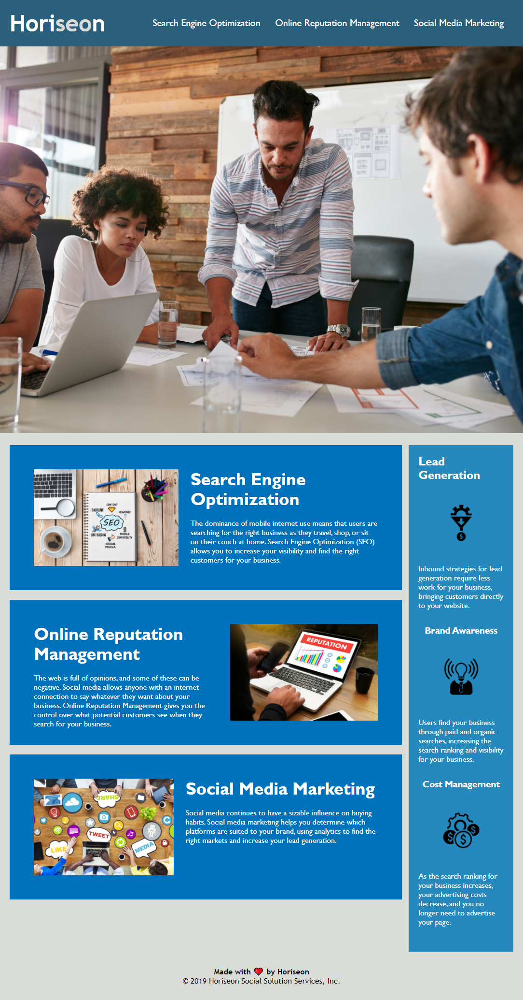

# Homework Assignment 1 - Horiseon 

For this assignment, I was given a predesigned HTML and CSS file of a working site. With these given templates, I was able to refactor both in ways that improved the accessibility of the site. Although there are many things that could have been done to improve a single site; I enhanced only a few key points that matched the given criteria for this assignment. 

### Some changes that were made includes the following: 
- Changing tags to semantic elements
- Improving the structure of the HTML elements
- Adding alt attributes to imgs
- Ensuring that heading attributes fall in sequential order

### Link to my assingment --> https://jonelleadona.github.io/homework-horiseon-ja.github.io/
